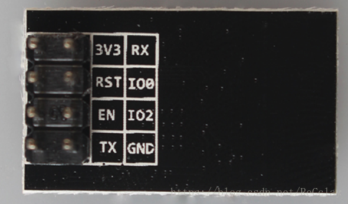
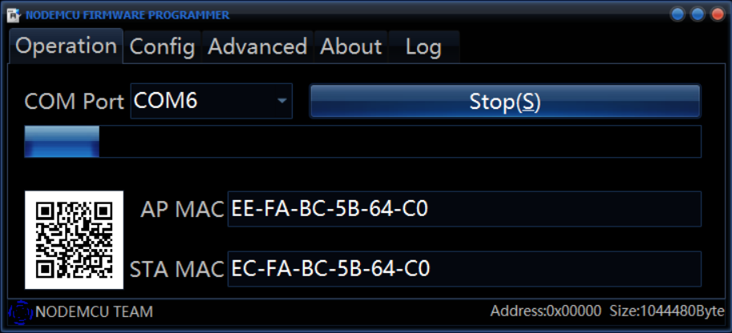
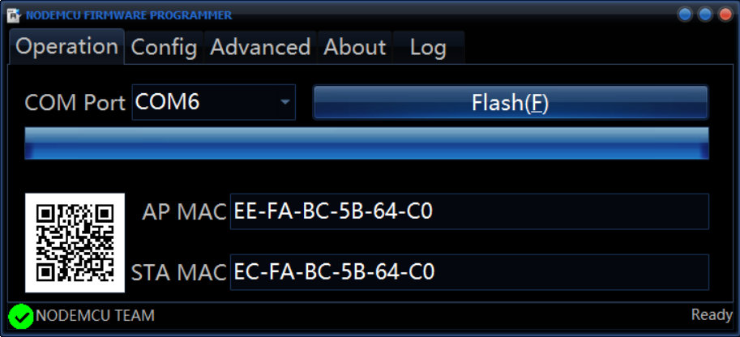
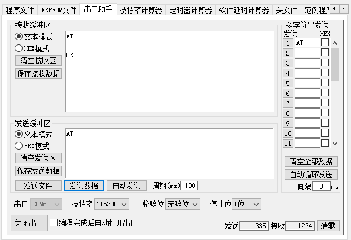
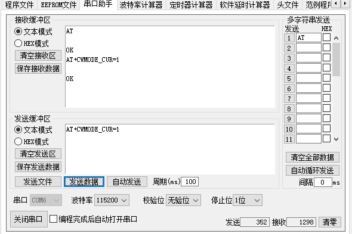

# ESP8266 ESP-01s AT 指令及固件烧录
===

作者: leylee

日期: 2020.4.13

[TOC]

## 1. ESP8266 AT 固件烧录

### 1.1 软件, 固件和驱动下载

我的 USB 转 TTL 模块使用了 CP2102 芯片. 将转接板插入电脑, Windows 10 会自动安装驱动. 如不能自动安装驱动, 可以右键设备, 选择 `更新驱动程序` 并 `自动搜索更新的驱动程序软件`. 随后在设备管理器中可以查看串口编号, 在我的电脑上是 `COM6`.

下载可用的固件: https://www.electrodragon.com/w/images/b/b1/V2.0_AT_Firmware%28ESP%29.zip 并解压.

下载烧录工具, Win32: https://github.com/nodemcu/nodemcu-flasher/tree/master/Win32/Release; Win64: https://github.com/nodemcu/nodemcu-flasher/tree/master/Win64/Release

### 1.2 ESP8266 引脚定义及接线

我使用的 ESP8266 型号是 ESP-01s, 引脚如下

其中, 烧录时, 接线为:

| ESP8266    | 转接板 |
| ---------- | ------ |
| 3V3           | 3V3    |
| RX            | TX     |
| TX            | RX     |
| GND           | GND    |
| GPIO16 (EN, 使能端) | 3V3 |
| GPIO0 (上电时, 低电平为烧录模式, 默认上拉) | GND |

RST 引脚低电平复位, 内部上拉. 

### 1.3 烧录

打开烧录工具 `ESP8266Flasher.exe`, 选择刚刚记录的串口号.

在 `Config` 中, 输入刚刚下载的固件的路径 (点击齿轮可以在资源管理器中选择文件), 并将烧写地址设为 `0x00000`.

回到 `Operation`, 点击 `Flash` 按钮, 烧录开始. 当下方出现绿色对号时, 烧录成功.

固件烧录成功, 移除 `GPIO0` 引脚的接线, 并重新上电, 即可正常使用了.

## 2. 简单的 AT 指令

通过串口工具, 向 ESP8266 模块发送 AT 指令, 即可控制其完成连接 WiFi 等操作. 一般的 AT 指令的格式为 `AT[+<cmd>[=<arg>]]\r\n`, 一条指令以 `AT` 开始, 后面使用 `+` 接命令, `=` 后接参数. 若执行成功, 返回 `OK`; 否则返回 `ERROR`.

通过串口助手, 发送 `AT[回车]` 的测试指令, 即可接收到模块返回的 `OK`.

*注意: 在`AT`命令后, 必须加一个回车, 才能表示指令结束. 且回车符为 `CR LF`, 缺一不可. 只有 `CR`, 指令不结束, 模块不返回信息; 只有 `LF`, 会返回 `ERROR`.*

设置 WiFi 模式: `AT+CWMODE_CUR=<mode>`, 当 `mode` 为 `1` 时, 为终端模式. 若指令的 `CUR` 改为 `DEF`, 则会将更改永久存储在 Flash 中, 其他指令同理.

连接 WiFi: `AT+CWJAP_CUR="<SSID>","<pwd>"[,"<bssid>"][,"<pci_en>"]`. 必填参数是 `SSID` 和 `<pwd>`, 若含有 `"` 或 `\` 等特殊字符,需要用`\`转义.

发送命令后, 等待几秒, 即可完成 WiFi 连接和自动获取IP的过程, 最终返回 `OK`.

更多指令, 可以访问 https://www.espressif.com/sites/default/files/documentation/4a-esp8266_at_instruction_set_cn.pdf 查看.

版权声明：

文章均由哈尔滨工业大学业余无线电俱乐部，技术部原创，转载请联系[联系地址](XXX@email.com)

